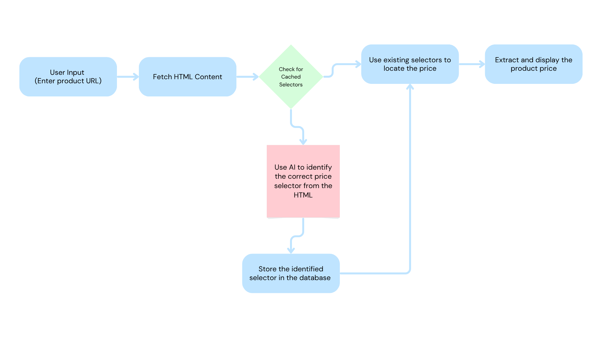

# Price Tracker

A Django-based web application for tracking product prices across different e-commerce websites. The system uses AI-powered price extraction and maintains a database of price selectors for efficient scraping.


## Key Features 

- **Dynamic Price Extraction**: Automatically identifies price elements on any e-commerce website
- **AI-Powered Selector Detection**: Uses DeepSeek API for intelligent price element identification
- **Caching System**: Stores price selectors by domain to reduce API calls
- **Asynchronous Processing**: Celery-based task queue for handling scraping requests
- **Error Handling**: Robust error management and task status tracking

## Technical Implementation

### Price Selector Caching

```python
class PriceSelector(models.Model):
    domain = models.CharField(max_length=100)
    tag = models.CharField(max_length=100, choices=[('span', 'span'), ('div', 'div')])
    css_selector = models.CharField(max_length=100, choices=[('id', 'id'), ('class', 'class')])
    value = models.CharField(max_length=100)
```
## celery task [View tasks.py]([https://github.com/shameemkk/price_tracker/blob/main/price_tracker/scrapper/tasks.py]

### Utility Functions [View utils.py]([https://github.com/shameemkk/price_tracker/blob/main/price_tracker/scrapper/utils.py]

- `fetch_clean_html()`: Uses Selenium for dynamic content loading and cleaning
- `extract_domain_from_url()`: Extracts base domain for selector caching
- `fetch_ai_analysis()`: Interfaces with DeepSeek API for price element analysis

## Challenges Overcome

1. **Dynamic Price Selectors**: Different e-commerce sites use varying HTML structures for price elements
   - Solution: AI-powered analysis to identify correct selectors
   - Caching selectors by domain to reduce API calls

2. **JavaScript Rendering**: Many sites use JavaScript to load prices dynamically
   - Solution: Selenium WebDriver for complete page rendering

3. **Error Handling**: Various failure points in the scraping process
   - Solution: Comprehensive error tracking and status updates

## Future Scope

### Price Monitoring System

- **Automated Price Tracking**
  - Regular price checks (daily/weekly)
  - Historical price data storage
  - Price trend analysis

### Alert System

- **Price Drop Notifications**
  - Email alerts for price changes
  - Custom price thresholds
  - Batch notification options

### Competitive Analysis

- **Market Intelligence**
  - Track competitor pricing
  - Price comparison across multiple sellers
  - Market trend reports

### User Features

- **Watchlist Management**
  - Custom monitoring schedules
  - Price target settings
  - Mobile notifications

## Installation and Setup

1. Clone the repository
2. Install dependencies: `pip install -r requirements.txt`
3. Configure Celery and Redis
4. Set up environment variables for DeepSeek API
5. Run migrations: `python manage.py migrate`
6. Start the development server: `python manage.py runserver`

## Contributing

Contributions are welcome! Please feel free to submit a Pull Request.
